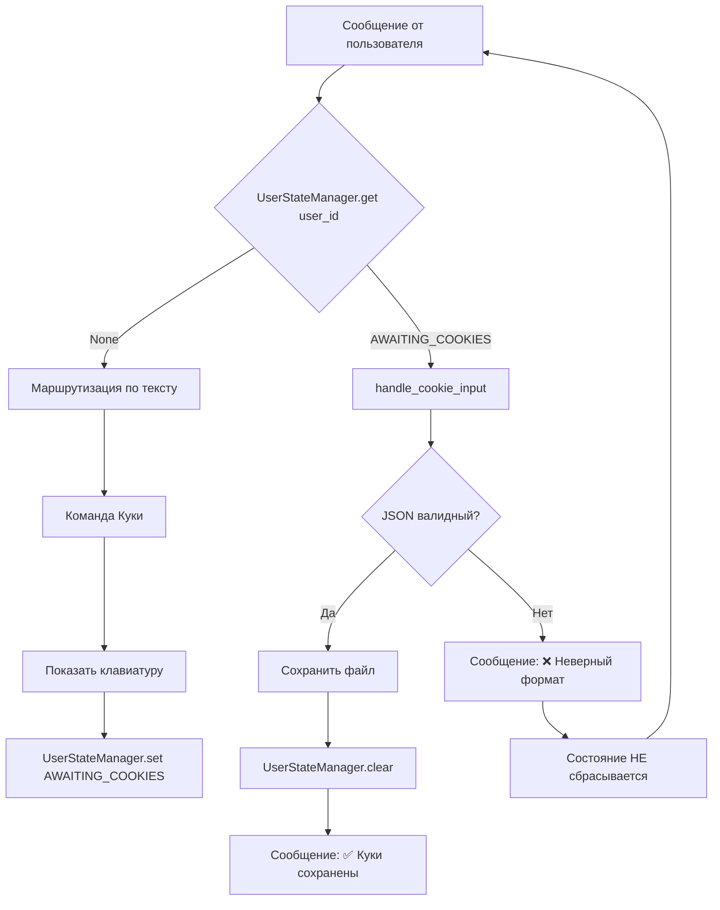

# План внедрения FSM (Finite State Machine) для управления состояниями бота

## Проблема

Сейчас после нажатия кнопки «Установить куки» бот показывает клавиатуру, но следующее сообщение пользователя обрабатывается как обычная команда через `handle_message`. Нет механизма, который сказал бы боту: «Это сообщение — не команда, а куки».

## Решение: In-memory FSM

Вводим слой состояний между получением сообщения и его маршрутизацией.

---

## 1. `app/vk/states/manager.py` — Хранилище состояний

```python
"""
In-memory FSM-хранилище.
Ключ — user_id, значение — строка состояния или None.
Потокобезопасность не требуется — VK LongPoll однопоточный.
"""

from logging import getLogger

logger = getLogger(__name__)


class UserStateManager:
    """
    Простое FSM-хранилище в памяти.
    Расширяется без изменения кода — просто добавь новое состояние.
    """
    _states: dict[int, str | None] = {}

    @classmethod
    def get(cls, user_id: int) -> str | None:
        """Вернуть текущее состояние пользователя или None."""
        return cls._states.get(user_id)

    @classmethod
    def set(cls, user_id: int, state: str | None) -> None:
        """Установить состояние пользователя. state=None сбрасывает."""
        cls._states[user_id] = state
        logger.debug(f"User {user_id} state set to {state}")

    @classmethod
    def clear(cls, user_id: int) -> None:
        """Сбросить состояние пользователя в None."""
        cls._states[user_id] = None
        logger.debug(f"User {user_id} state cleared")
```

---

## 2. `app/vk/states/cookie.py` — Состояния для cookie

```python
from enum import Enum


class CookieState(str, Enum):
    """Состояния для сценария работы с куки."""
    AWAITING_COOKIES = "AWAITING_COOKIES"
```

---

## 3. `app/vk/states/__init__.py` — Экспорт

```python
from .manager import UserStateManager
from .cookie import CookieState
```

---

## 4. `app/vk/handlers/states/cookie_input.py` — Обработчик ввода куки

Новый хэндлер, который принимает текст от пользователя как куки.

```python
import json
from logging import getLogger

from app.config import Config
from app.vk.keyboards import get_cookie_actions_keyboard
from app.vk.states import UserStateManager

logger = getLogger(__name__)


def handle_cookie_input(bot, message: dict) -> None:
    """
    Обрабатывает сообщение как JSON с куки.
    Если парсинг успешен — сохраняет и сбрасывает состояние.
    Если нет — просит повторить или даёт кнопку «На главную».
    """
    user_id = message["from_id"]
    text = message["text"].strip()

    try:
        cookies = json.loads(text)
        # Нормализация: если прислали {"cookies": [...]} — берём список
        if isinstance(cookies, dict):
            cookies = cookies.get("cookies", cookies)
        if not isinstance(cookies, list):
            raise ValueError("Ожидается список cookie")

        Config.COOKIES_FILE.write_text(json.dumps(cookies, indent=2, ensure_ascii=False))
        UserStateManager.clear(user_id)

        bot.send_message(
            user_id=user_id,
            message="✅ Куки сохранены",
            keyboard=get_cookie_actions_keyboard(cookie_file_exists=True)
        )

    except (json.JSONDecodeError, ValueError) as e:
        logger.warning(f"User {user_id} sent invalid cookies: {e}")
        bot.send_message(
            user_id=user_id,
            message="❌ Неверный формат. Пришли JSON-список куки или нажми «Главная»"
        )
```

---

## 5. Изменение `app/vk/handlers/commands/cookie.py`

В `handle_cookie_message` после отправки клавиатуры **устанавливаем состояние**:

```python
from app.vk.states import UserStateManager, CookieState

def handle_cookie_message(bot, message: dict):
    text = message["text"].lower()
    user_id = message["from_id"]

    log_message_handling(logger, __name__, user_id, text)

    cookie_file_exists = Config.COOKIES_FILE.exists()
    keyboard = get_cookie_actions_keyboard(cookie_file_exists)

    bot.send_message(
        user_id=user_id,
        message="Выбери действие",
        keyboard=keyboard
    )

    # Устанавливаем состояние — следующий текст будет воспринят как куки
    UserStateManager.set(user_id, CookieState.AWAITING_COOKIES)
```

---

## 6. Изменение `app/vk/handlers/message.py`

Добавляем проверку состояния **до** маршрутизации по тексту:

```python
from app.vk.states import UserStateManager, CookieState
from app.vk.handlers.states.cookie_input import handle_cookie_input

def handle_message(bot, message: dict):
    user_id = message["from_id"]
    text = message["text"].strip()

    # 1. Проверка активного состояния
    state = UserStateManager.get(user_id)
    if state == CookieState.AWAITING_COOKIES:
        handle_cookie_input(bot, message)
        return

    # 2. Обычная маршрутизация по тексту
    handlers = {
        'помощь': handle_help_message,
        'куки': handle_cookie_message,
        'текущие куки': handle_current_cookie_message
    }

    handler = handlers.get(text.lower(), handle_unknown_message)
    handler(bot, message)
```

---

## 7. Обновление `app/vk/handlers/commands/__init__.py`

```python
from .cookie import handle_cookie_message, handle_current_cookie_message
from .help import handle_help_message
from .unknown import handle_unknown_message
from .states.cookie_input import handle_cookie_input  # если импорт нужен
```

---

## 8. Обновление `app/vk/handlers/__init__.py`

Пока пустой — можно оставить как есть, либо добавить импорт для удобства:

```python
from . import commands
from . import states
```

---

## Схема работы



---

## Почему именно так

| Аспект | Решение |
|---|---|
| **Где хранить** | In-memory dict — не требует БД, редиса, файлов. Потеря при перезапуске некритична |
| **Как расширять** | Добавляешь новое значение в `CookieState` (или новый enum) + новый хэндлер в `app/vk/handlers/states/` |
| **Как сбросить** | `UserStateManager.clear(user_id)` — вызывается после успеха или при команде «Главная» |
| **Безопасность** | Состояние привязано к user_id — пользователи не влияют друг на друга |